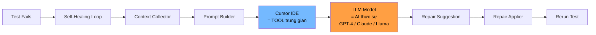
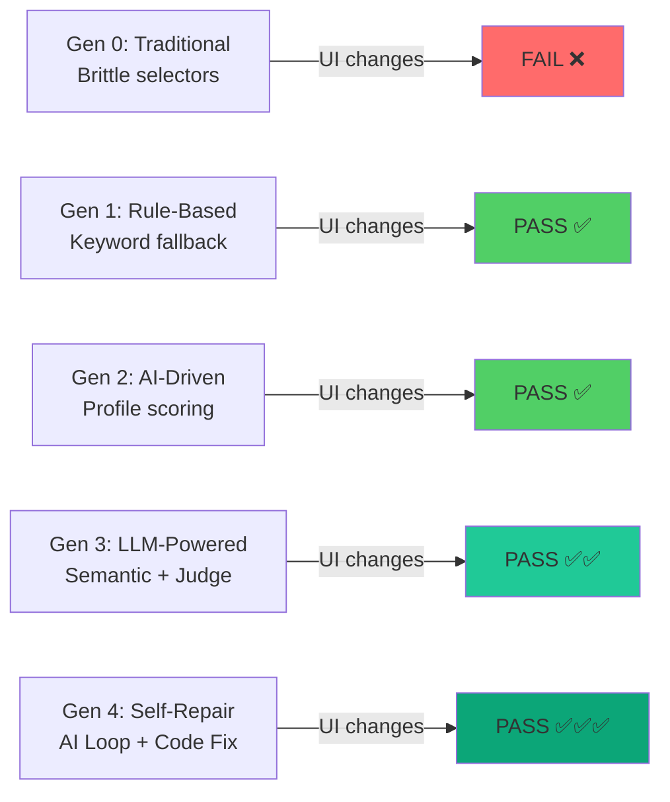
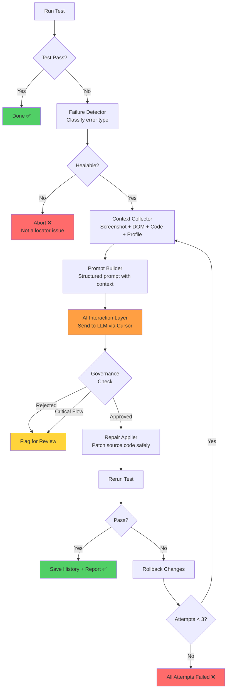
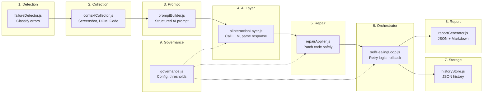
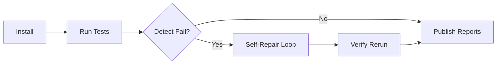

# AI-Driven Test Automation: Self-Healing + Self-Repair with LLM

> Demo project cho **"AI-Driven Test Automation: Tự động sinh Test Case, Self-Healing Tests & Self-Repair với LLM"**
>
> So sánh 5 thế hệ test automation: **Traditional** → **Rule-Based** → **AI-Driven** → **LLM-Powered** → **Self-Repair**

## Self-Healing vs Self-Repair

| Concept | Self-Healing (Gen 1-3) | Self-Repair (Gen 4) |
|---------|----------------------|---------------------|
| **Khi nào** | Runtime (trong lúc test chạy) | Sau khi test fail |
| **Làm gì** | Tìm locator thay thế trong DOM | Sửa source code test |
| **Phạm vi** | Chỉ thay đổi locator tạm thời | Cập nhật file `.spec.js` vĩnh viễn |
| **Vòng lặp** | Thử strategies 1 lần | Phân tích → sửa → chạy lại (max 3 lần) |
| **AI** | Scoring, embedding, judge | Full prompt → LLM → code patch |

## Vai trò của AI và Cursor



**Cursor KHÔNG phải là AI.** Cursor là:
- IDE / công cụ phát triển
- Trung gian gọi LLM model
- Hỗ trợ đọc và sửa code

**AI thực sự là LLM model:**
- GPT-4, GPT-4o-mini (OpenAI)
- Claude (Anthropic)
- Llama, Mistral (Ollama local)

## Project Structure

```
self-healing-demo/
├── README.md
├── Jenkinsfile                                # CI/CD pipeline
├── main-app/                                  # React + Vite web application
│   ├── package.json
│   ├── vite.config.js
│   └── src/
│       ├── config/uiVersion.js                # UI version switcher (v1/v2)
│       ├── pages/
│       │   ├── LoginPage.jsx
│       │   ├── DashboardPage.jsx
│       │   └── ProfilePage.jsx
│       └── components/
│           ├── Navbar.jsx
│           └── DataTable.jsx
│
└── automation-test/                           # Playwright test suite
    ├── package.json
    ├── playwright.config.js
    ├── run-demo.js                            # Demo runner (6 scenarios)
    ├── .env.example                           # LLM config template
    │
    ├── config/
    │   └── governance.js                      # Human governance rules
    │
    ├── locators/                              # V1 CSS selectors (brittle)
    │   ├── login.locators.js
    │   └── dashboard.locators.js
    │
    ├── profiles/                              # Element profiles
    │   ├── login.profiles.js
    │   ├── dashboard.profiles.js
    │   └── elementProfile.js                  # Profile factory + enrichment
    │
    ├── utils/
    │   ├── selfHealing.js                     # Gen 1: Rule-based healing
    │   ├── aiHealing.js                       # Gen 2: AI-driven (static scoring)
    │   ├── llmHealing.js                      # Gen 3: LLM-powered healing
    │   ├── failureDetector.js                 # Gen 4: Failure detection & classification
    │   ├── contextCollector.js                # Gen 4: Runtime context gathering
    │   ├── promptBuilder.js                   # Gen 4: Structured prompt creation
    │   ├── aiInteractionLayer.js              # Gen 4: LLM API interaction
    │   ├── repairApplier.js                   # Gen 4: Safe code patching
    │   ├── selfHealingLoop.js                 # Gen 4: Repair orchestration loop
    │   ├── historyStore.js                    # Gen 4: Repair history (JSON)
    │   ├── reportGenerator.js                 # Gen 4: JSON + Markdown reports
    │   ├── similarity.js                      # String similarity algorithms
    │   ├── llmService.js                      # Unified LLM client
    │   ├── embeddingService.js                # Embedding similarity + cache
    │   ├── llmJudge.js                        # LLM-as-Judge
    │   ├── healingLogger.js                   # Rule-based healing logger
    │   └── locatorStore.js                    # Persistent healed locator cache
    │
    ├── generators/
    │   ├── syncHealed.js
    │   ├── profileGenerator.js
    │   └── testGenerator.js
    │
    ├── tests/
    │   ├── traditional/                       # Gen 0: Hardcoded locators
    │   ├── self-healing/                      # Gen 1: Rule-based healing
    │   ├── ai-healing/                        # Gen 2: AI-driven healing
    │   ├── llm-healing/                       # Gen 3: LLM-powered healing
    │   ├── self-repair/                       # Gen 4: AI self-repair loop
    │   │   ├── login.spec.js
    │   │   ├── dashboard.spec.js
    │   │   └── form-submit.spec.js
    │   └── llm-generated/
    │
    ├── healed-locators/                       # Healing results + cache
    └── repair-reports/                        # Gen 4: Repair reports
        ├── repair-history.json
        ├── snapshots/                         # Screenshots + DOM snapshots
        └── backups/                           # File backups before patching
```

## Quick Start

```bash
# 1. Install dependencies
cd main-app && npm install && cd ..
cd automation-test && npm install && npx playwright install chromium && cd ..

# 2. (Optional) Configure LLM for Gen 3-4 features
cd automation-test
cp .env.example .env
# Edit .env with your OpenAI API key or Ollama URL

# 3. Run all scenarios (Gen 0-3)
npm run test:demo

# 4. Run with Gen 4 Self-Repair included
npm run test:demo:full

# 5. Run only Gen 4 Self-Repair tests
npm run test:repair:v2
```

## 5 Generations of Test Healing



| Gen | Command | On UI V2 | How It Works |
|-----|---------|----------|--------------|
| 0: Traditional | `npm run test:traditional:v2` | FAIL | Hardcoded CSS selectors |
| 1: Rule-Based | `npm run test:healing:v2` | PASS | Keyword + synonym fallback |
| 2: AI-Driven | `npm run test:ai:v2` | PASS | Profile scoring + confidence |
| 3: LLM-Powered | `npm run test:llm:v2` | PASS | Semantic similarity + LLM judge |
| 4: Self-Repair | `npm run test:repair:v2` | PASS | AI loop → analyze → fix → rerun |

## Gen 4: Self-Repair Architecture

### The Repair Loop (Core Concept)



**Đây KHÔNG phải retry đơn thuần.** Mỗi lần lặp:
1. **Phân tích lại** failure với context mới
2. **Cải thiện prompt** dựa trên lần thử trước
3. **Thử approach khác** nếu lần trước không work

### 9 Modules của Gen 4



### Element Profile Concept

Không chỉ dùng locator string. Mỗi element có một **profile** đầy đủ giúp AI hiểu intent:

```javascript
{
  logicalName: 'usernameInput',        // human-readable name
  page: 'login',                       // which page
  actionType: 'fill',                  // click, fill, select, verify
  selector: '#username',               // CSS selector (may be outdated)
  tag: 'input',                        // HTML tag
  role: 'textbox',                     // ARIA role
  label: 'Username',                   // visible label
  placeholder: 'Enter your username',  // placeholder text
  text: '',                            // visible text content
  attributes: { name: 'username' },    // HTML attributes
  nearbyText: ['Username', 'Password', 'Login'],  // surrounding text
  intent: 'Enter data into the username input',    // WHY (Gen 4)
}
```

### Human Governance

Gen 4 có **governance layer** để kiểm soát:

```javascript
// config/governance.js
{
  maxRetryAttempts: 3,
  confidenceThreshold: {
    autoApply: 0.80,    // >= 80%: auto-fix
    needsReview: 0.40,  // 30-80%: fix but flag for review
    reject: 0.30,       // < 30%: reject
  },
  criticalFlows: ['login', 'checkout', 'payment', 'password-reset'],
  allowAutoFixCritical: false,  // critical flows need human review
}
```

| Rule | Description |
|------|-------------|
| **Max retries** | Tối đa 3 lần repair |
| **Confidence threshold** | Reject < 30%, review 30-80%, auto-fix >= 80% |
| **Critical flows** | Login, payment, checkout, password-reset cần human review |
| **Backup** | Tạo backup trước khi patch code |
| **Rollback** | Tự động rollback nếu test vẫn fail sau patch |

Governance **KHÔNG nằm trong execution flow** - chỉ là config values.

### Repair Report

Mỗi repair session tạo report (JSON + Markdown) chứa:

| Field | Description |
|-------|-------------|
| Test name | Tên test bị fail |
| Step fail | Step cụ thể bị lỗi |
| Old locator | Locator cũ không hoạt động |
| Screenshot | Ảnh chụp page lúc fail |
| DOM snapshot | HTML snapshot |
| Attempts | Số lần thử repair |
| Each fix | Chi tiết mỗi lần sửa |
| Final result | Pass hay fail sau repair |
| Files modified | File nào đã bị sửa |

## Previous Generations

### Gen 1: Rule-Based Healing

| Strategy | How |
|----------|-----|
| Cache | Reuse previously healed locators |
| Label | Match by associated `<label>` text |
| Placeholder | Match by placeholder attribute |
| ARIA | Match by aria-label |
| Name | Match by name attribute |
| Text | Match by visible button/link text |
| Data attributes | Match by data-testid, data-action |
| CSS similar | Match by partial ID pattern |
| Form position | Match by input position in form |

### Gen 2: AI-Driven (Static Scoring)

11-dimension weighted scoring with confidence thresholds.

### Gen 3: LLM-Powered

Embedding similarity + LLM-as-Judge for ambiguous cases.

### Scoring Dimensions (Gen 2-3)

| Dimension | Weight | Gen 2 | Gen 3 |
|-----------|--------|-------|-------|
| `tag` | 0.08 | Exact | Exact |
| `role` | 0.06 | Implicit ARIA | Implicit ARIA |
| `type` | 0.05 | Type check | Type check |
| `text` | 0.10 | Fuzzy | Embedding |
| `label` | 0.16 | Fuzzy | Embedding |
| `placeholder` | 0.10 | Fuzzy | Embedding |
| `attributes` | 0.16 | Jaccard | Jaccard |
| `action` | 0.05 | Tag compat | Tag compat |
| `parent` | 0.08 | Fuzzy | Embedding |
| `nearbyText` | 0.08 | Token overlap | Embedding |
| `dataTestId` | 0.08 | Exact | Exact |

## Jenkins CI/CD Pipeline



Pipeline stages:
1. **Install** - npm ci + playwright install
2. **Run Tests** - initial test execution
3. **Detect** - check for failures
4. **Self-Repair** - AI-driven repair loop (if tests failed)
5. **Rerun** - verify repaired tests pass
6. **Publish** - archive reports and artifacts

```bash
# Local execution equivalent
npm run test:repair:v2
```

## LLM Configuration

### Option 1: OpenAI (Recommended)

```env
OPENAI_API_KEY=sk-proj-xxxxxxxxxxxxxxxxxxxx
OPENAI_MODEL=gpt-4o-mini
OPENAI_EMBEDDING_MODEL=text-embedding-3-small
```

### Option 2: Ollama (Local, Free)

```bash
ollama pull llama3.2
ollama pull nomic-embed-text
```

```env
OLLAMA_URL=http://localhost:11434
OLLAMA_MODEL=llama3.2
OLLAMA_EMBEDDING_MODEL=nomic-embed-text
```

### Option 3: No LLM (Fallback)

Without LLM, Gen 3 falls back to Gen 2 static scoring.
Gen 4 Self-Repair uses mock heuristic responses (limited effectiveness).

## All Available Commands

| Command | Description |
|---------|-------------|
| `npm run test:traditional:v1` | Gen 0 on UI V1 (should PASS) |
| `npm run test:traditional:v2` | Gen 0 on UI V2 (should FAIL) |
| `npm run test:healing:v2` | Gen 1: Rule-based healing |
| `npm run test:ai:v2` | Gen 2: AI-driven healing |
| `npm run test:llm:v2` | Gen 3: LLM-powered healing |
| `npm run test:repair:v2` | Gen 4: Self-repair loop |
| `npm run test:demo` | Run scenarios 1-5 |
| `npm run test:demo:full` | Run all 6 scenarios (incl. Gen 4) |
| `npm run generate:profiles` | Auto-generate element profiles |
| `npm run generate:tests` | LLM auto-generate test cases |
| `npm run sync:healed` | Update source locators from cache |
| `npm run sync:healed:dry` | Preview sync changes |
| `npm run report` | Show Playwright HTML report |
| `npm run report:repair` | List repair report files |

## How to Run Demo

```bash
# Step 1: Install everything
cd self-healing-demo
cd main-app && npm install && cd ..
cd automation-test && npm install && npx playwright install chromium

# Step 2: (Optional) Set up LLM
cp .env.example .env
# Edit .env with API key

# Step 3: Run the comparison demo
npm run test:demo

# Step 4: Run Gen 4 Self-Repair
npm run test:repair:v2

# Step 5: Check reports
ls repair-reports/
cat repair-reports/*.md
```

## Limitations

| Limitation | Description |
|-----------|-------------|
| **LLM dependency** | Gen 4 works best with LLM API. Mock fallback has limited accuracy |
| **Single-page** | Profiles are per-page, no cross-page inference |
| **No visual AI** | Cannot compare screenshots (future: GPT-4V) |
| **Locator scope** | Repairs locator issues. Cannot fix business logic errors |
| **Cost** | LLM API calls add cost (~$0.01-0.10 per repair cycle) |
| **Latency** | LLM calls add ~2-5s per repair attempt |
| **Critical flows** | login/payment auto-fix disabled by default (governance) |

## Future Improvements

- **Visual AI**: Screenshot comparison using vision models
- **Adaptive weights**: Train scoring weights from historical data
- **Multi-step repair**: Fix multiple locators in a single loop
- **CI auto-commit**: Auto-commit repaired code to branch
- **Fine-tuned model**: Train small model for element matching
- **Cross-page context**: Score elements relative to navigation flow
